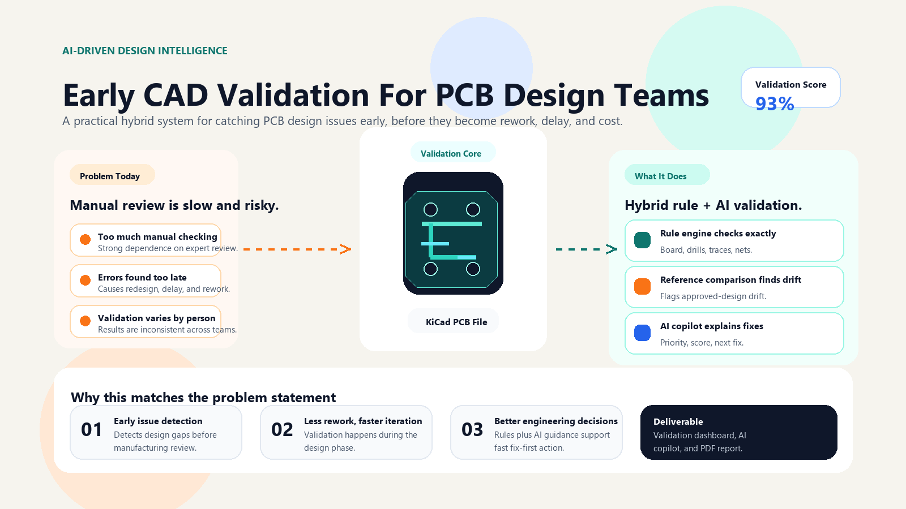
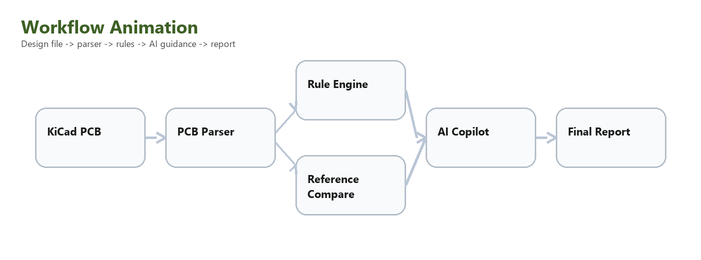
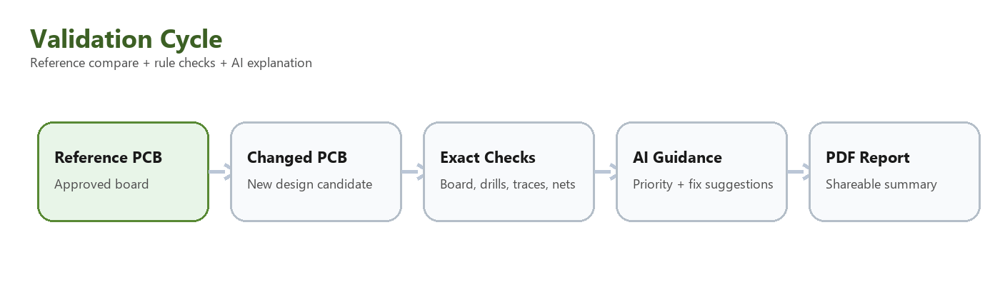

# TraceWise PCB Validator

TraceWise is a PCB design validation platform built for early-stage review of KiCad board files. It combines exact rule-based checking, reference-board comparison, and AI-assisted guidance so engineering teams can catch layout issues before fabrication review.

## What It Does

- Validates real `.kicad_pcb` files at design time
- Checks board size, drill count, hole diameter, trace width, spacing, and routing health
- Compares a candidate board against an approved reference PCB
- Generates severity-based validation results and a compact PDF report
- Supports AI guidance for plain-English explanation and fix suggestions

## Why It Matters

PCB review is often slow, manual, and dependent on expert checking. TraceWise helps teams detect design drift and rule violations earlier, reducing rework and improving first-pass design quality.

## Core Features

- Rule-based PCB validation
- Reference comparison against an approved board
- AI copilot for explanation and prioritization
- Watcher-based near real-time validation workflow
- PDF validation report generation

## Project Screens

### Problem Statement Visual



### Workflow Animation



### Validation Cycle



## Demo Boards Included

- `demo_boards/triac_reference.kicad_pcb` - approved reference board
- `demo_boards/triac_changed_example.kicad_pcb` - changed candidate board for demo validation

## Tech Stack

- Streamlit
- Python
- KiCad `.kicad_pcb` parsing
- Custom rule engine
- Gemini / OpenAI API integration
- ReportLab for PDF reports

## Run Locally

```powershell
pip install -r requirements.txt
streamlit run apps.py
```

## AI Setup

Set either one of these environment variables:

- `GEMINI_API_KEY`
- `OPENAI_API_KEY`

The core rule-based validator still works even without an AI key.

## Repository Structure

```text
tracewise-pcb-validator/
├── apps.py
├── rule_app.py
├── cad_rules.py
├── kicad_parser.py
├── pcb_rule_watcher.py
├── pcb_report_generator.py
├── llm_assistant.py
├── demo_boards/
└── assets/
```

## Status

This is a focused prototype for AI-assisted PCB design validation and review.
